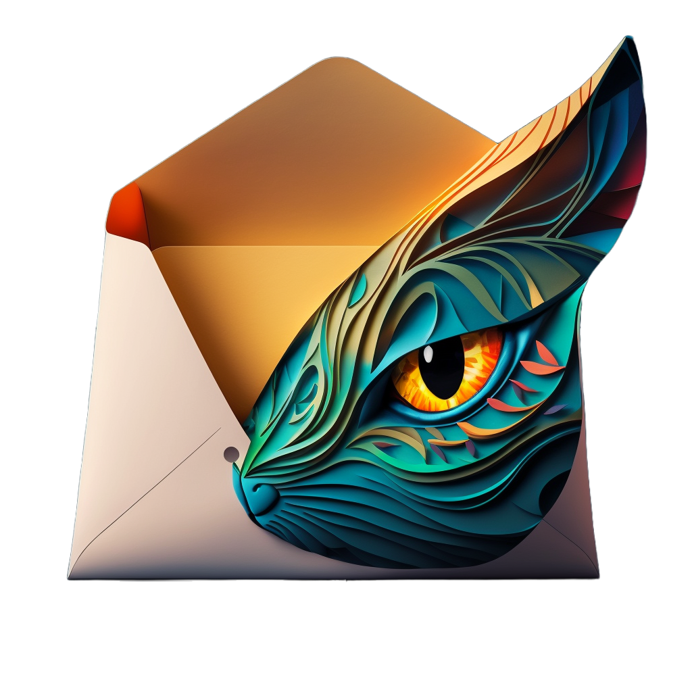
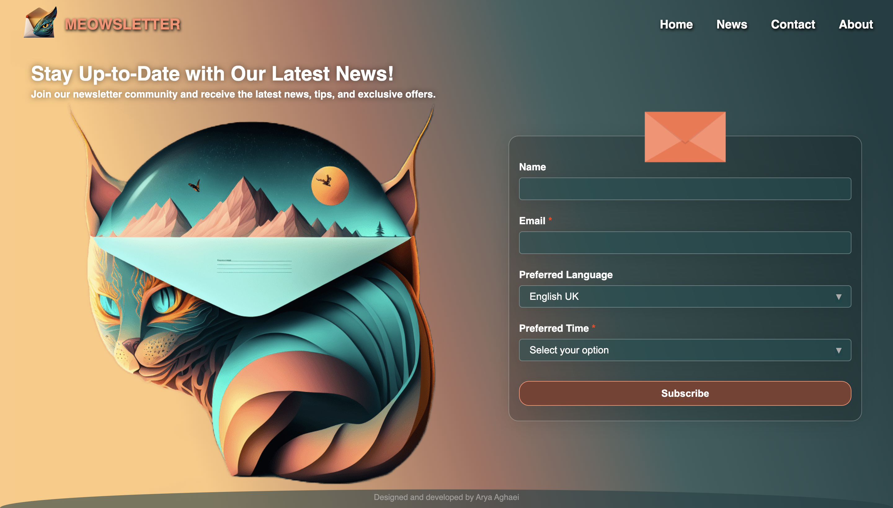

<br/>
<p align="center">
  <a href="https://github.com/Arya-Aghaei/meowsletter">
    
  </a>

  <h3 align="center">MEOWSLETTER</h3>

  <p align="center">
    A newsletter registration form 
    <br/>
    <br/>
  </p>
</p>


## Table Of Contents

- [About the Project](#about-the-project)
- [Built With](#built-with)
- [Getting Started](#getting-started)
  - [Installation](#installation)
- [Usage](#usage)
- [Authors](#authors)

## About The Project



Meowsletter! A newsletter project built with React and powered by LOVE 🫶!

## Built With

The user interface of Meowsletter is built with React, Typescript, Styled Components, and Lottie Animations, providing a smooth and responsive experience for viewers. The React components are organized and optimized for optimal performance, making the newsletter fast and user-friendly.

AI
The challenge involves using a personal interest in design while utilizing AI to generate photos that add uniquness and creativity to the project.

Fun and Creative Name
Meowsletter wasn't just a technical challenge for me, it was also a fun and creative project. The name itself, "Meowsletter", adds a touch of playfulness to the project, hopefully, making it a standout among the participants of this challenge.

- [Background and Logo Images (AI)](https://www.midjourney.com/)
- [React]()
- [Styled Components](https://styled-components.com/)
- [Lottie](https://lottiefiles.com/)
- [Cypress](https://www.cypress.io/)

## Getting Started

Getting started with this React app is easy! Simply follow these steps:

- Clone the repository to your local machine.
- Install dependencies by running npm install in the terminal.
- Start the development server by running npm start.
- Open your browser and navigate to http://localhost:3000 to view the app.
  That's it! You're now ready to start exploring the app. Happy reviewing!

### Installation

1. Clone the repo

```sh
git clone https://github.com/Arya-Aghaei/meowsletter.git
```

2. Install NPM packages

```sh
npm install
```

or

```sh
yarn install
```

3. (Optional) Enter your API url in `.env` file

```JS
REACT_APP_API_URL=http://localhost:8080
```

## Usage

To start the project run:

```sh
npm start
```

or

```sh
yarn start
```

it is recommended to put the front-end and back-end projects side by side in a folder structure like this:

```sh
meowsletter
├── meowsletter-api
└── meowsletter
```

then to run the backend and server together, run the following commands in the terminal:

```sh
cd meowsletter && npm run dev
```

or

```sh
cd meowsletter && yarn dev
```

## Testing

To run the component testing, run the following command

```sh
yarn test
```

or for testing accessibility, run the following command

```sh
yarn test:accessibility
```

to run the tests in GUI mode, run the following command

```sh
yarn cypress
```

## Authors

- **Arya Aghaei** - _Frontend Developer_ - [Github](https://github.com/Arya-Aghaei/) - [Linkedin](https://www.linkedin.com/in/arya-aghaei/)

